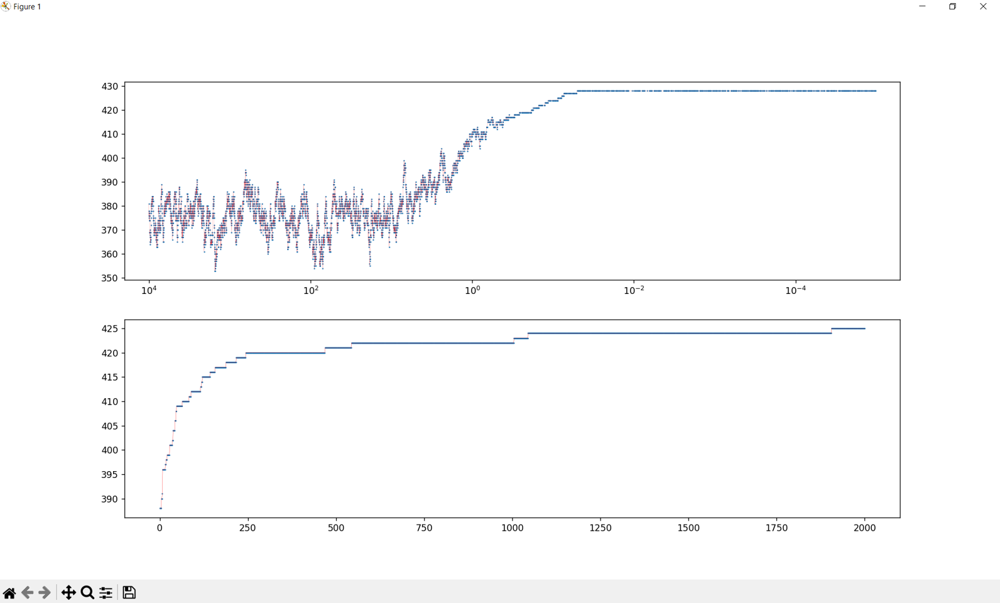
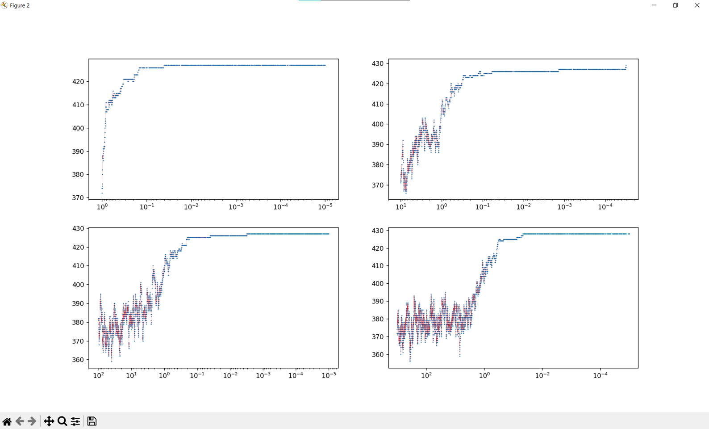
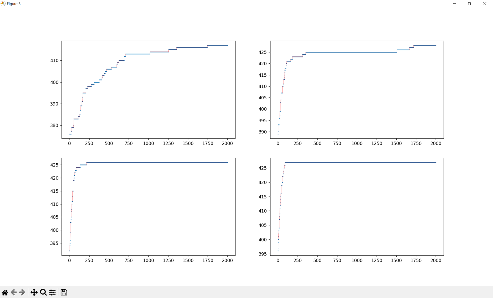
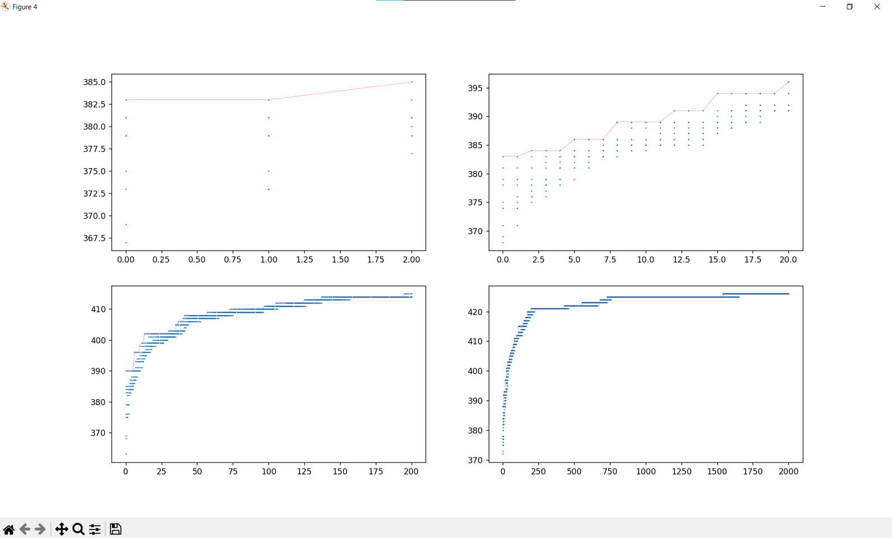

<!-- About the Project -->
## About

Implemented `Simulated Annealing` and `Genetic` algorithms to solve the SAT problem in CNF form.

### Objective Function

```python
def countTrueClauses(clauses, variables)
```

### Simulated Annealing Algorithm

```python
def simulatedAnnealing(clauses, varNum, T = 10000, Tmin = 0.00001, Alpha = 0.998)
```

### Genetic Algorithm

```python
def genetic(clauses, varNum, MaxIteration = 2000, PopulationSize = 10, Pc = 0.8, Pm = 0.1)
```

## Results


* Simulated Annealing
* Genetic  
`with default hyperparameters`
---

### Simulated Annealing

* `T = 1`
* `T = 10`
* `T = 100`
* `T = 1000`
---

### Genetic
  
* `PopulationSize = 2`
* `PopulationSize = 20`
* `PopulationSize = 200`
* `PopulationSize = 2000`
---


population of each iteration
* `MaxIteration = 2`
* `MaxIteration = 20`
* `MaxIteration = 200`
* `MaxIteration = 2000`